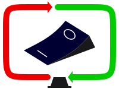

  <h1>data synchronization using a mathematical aproach</h1>

  

  
Mathsync is a tiny cross-language open-source library to easily let web applications synchronize state with their server after being offline for some time. The library is meant to be pluggable aside business logic and do the hard work of efficiently retrieving updates which occurred on the server in the mean time.

  <a class="btn btn-large btn-primary" href="learn_more.html">Learn more</a>
  <a class="btn btn-large btn-primary" href="javascript.html">Get started in javascript</a>
  <a class="btn btn-large btn-primary" href="java.html">Get started in java</a>

